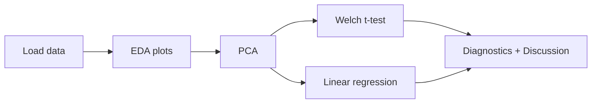

# UTR Data Analysis

> Statistical exploration of 3′ and 5′ untranslated regions: how do length and UTR class shape GC content and motif repertoire?

[](https://www.python.org/)  
[](LICENSE)

## Table of Contents
- [Overview](#overview)
- [Quick Start](#quick-start)
- [Reproducing-the-Analysis](#reproducing-the-analysis)
- [Key Results](#key-results)
- [Project Requirements](#project-requirements)
- [License](#license)
- [Acknowledgements](#acknowledgements)
- [Citation](#citation)
- [Contact](#contact)

## Overview
**Research question**: *How do sequence length and untranslated region (UTR) type (3′ vs 5′) influence GC content, and what patterns in motif composition underlie any differences?*

This repository accompanies the notebook **`utr_data_analysis.ipynb`**, which walks through:

1. Exploratory data analysis (EDA)  
2. PCA of seven regulatory motifs  
3. Welch’s *t*-test comparing GC% between UTR classes  
4. Linear regression of GC% on log‑length and UTR type  
5. Diagnostic checks for each model  
6. A concise discussion of biological implications

The dataset comprises **4 000 human UTR sequences** with per‑sequence GC% and counts for seven AU‑ or GC‑rich motifs (e.g. `ACA`, `GCGC`).


## Quick Start
```bash
# 1. Grab the code
git clone https://github.com/<your-username>/<repo-name>.git
cd <repo-name>

# 2. Create the conda environment (≈ 1–2 min)
conda env create -f environment.yml
conda activate utr-analysis

# 3. Launch JupyterLab and run the notebook
jupyter lab notebooks/01_utr_data_analysis.ipynb
```

> **Tip** Prefer the cloud? Adjust the Binder badge below with your GitHub username and click to launch the notebook in a one‑click reproducible environment.  
> `[](https://mybinder.org/v2/gh/<your-username>/<repo-name>/HEAD?labpath=notebooks%2F01_utr_data_analysis.ipynb)`

## Reproducing the Analysis
All figures and statistics will regenerate unaltered if you run the notebook top‑to‑bottom. The workflow is fully deterministic:



## Key Results
| Finding | Evidence | Practical takeaway |
|---------|----------|--------------------|
| **GC gap of ~15 pp** between UTR classes | Welch’s *t* = −36.2, *p* ≈ 10⁻²⁴⁸, Cohen’s *d* = 1.15 | 5′ UTRs are systematically GC‑richer—composition is a strong classifier |
| Length effect is mild | OLS: log‑length coef = −0.013 (95 % CI −0.017…−0.010) | Very long 3′ UTRs tend to be AU‑rich but the change is ~1 pp per 10× length |
| Motif repertoire mirrors GC bias | PCA (PC1 ≈ 36 %) separates AU‑rich (`ACA*`) vs GC‑rich (`GCGC*`) motifs | Regulatory elements at each end of mRNAs reflect their bulk composition |

View the notebook for full plots and in‑depth commentary.

## Project Requirements
The analysis relies on the scientific Python stack:

- pandas ≥ 2.0  
- numpy  
- matplotlib  
- seaborn  
- scipy  
- statsmodels  
- scikit‑learn  
- adjustText  

## License
Distributed under the MIT License. See [`LICENSE`](LICENSE.md) for details.

## Acknowledgements
This work was completed as an **assignment for the “Biostatistics” course at IBB PAS, tutored by Dr Michał A. Ciach**.


